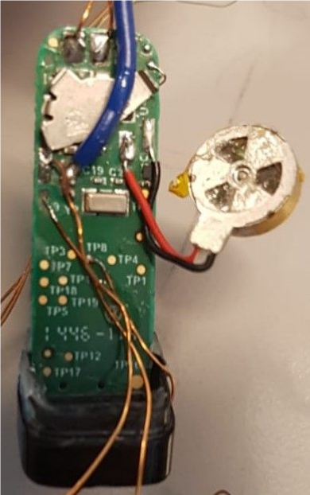
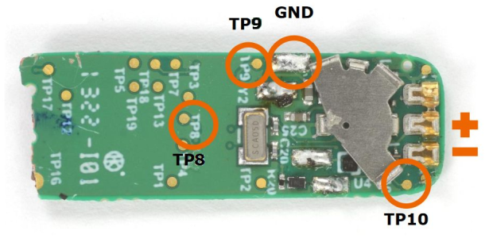
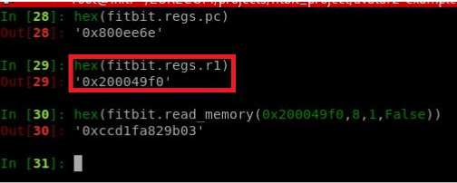

# Fitbit Bluetooth Analysis using avatar²

Perform dynamic analysis of the fitbit's firmware bluetooth functions.

### Overview

In this example, we used avatar² to reach specific bluetooth routines and then transfer execution 
to qemu which allow us to do further analysis.

### Contents

- `fitbit_bluetooth_analysis.py` - the avatar²-script
- `fitbit.cfg` - the openocd configuration file
- `patched_firmware.bin` - binary version of the firmware used for this example, which is a patched 
						   version of fitbit firmware that implement a GDB backdoor.

### Device Setup:

1. To reach the PCB, the plastic part that covers the fitbit needs to be melted.At the end, the PCB looks like the figure below:


<p align="center"> 

</p>

2. the fitbit could be connected to a Debug unit through an Serial Wire Debug (SWD) interface. On the pcb four test points that could be used for debugging as the figure below shows:


<p align="center"> 

</p>

3. As a debug adapter we used STLINK-V2-1 of a nucleo board that support SWD
4. The Pairing between ST-LINK-V2 and fitbit


					|  SWD pins |  ST-LINK-V2-1 pins |  Fitbit test points |
					|-----------|--------------------|---------------------|
					|  SWDCLK   |  Pin 2			 |		   TP8		   |
					|  SWDIO    |  Pin 4 			 |		   TP9  	   |
					|  GND      |  Pin 3			 |         GND 	       |
					|  NRST     |  Pin 5  			 |         TP10	       |


5. The figure below shows the final setup

<figure>
	<p align="center">
    
    <figcaption>Final setup</figcaption>
    </p>
</figure>

### Demo

1. Using avatar script we were able to reach the breakpoint at 0x0800EE62: get_bluetooth_id
when we use the mobile application and try to pair the fitbit with an Android device. But
before that, this address was reached twice in the initialization process .

	● First & second hit: get_bluetooth_id was called by "0x80187d9" instruction inside the
"bluetooth_record" function.
	● Third hit: when we try to pair the app and the fitbit. Here a function 0x800ee55:
"send_bt_id_c0" call get_bluetooth_id and then send bluetooth_id to the app which
will enable the pairing.

2. After reaching the third breakpoint the state was transferred to Qemu to emulate the
execution. So by using Ipython.embed(), we were able to continue testing other
functionalities and reaching other breakpoints while using the emulator. In addition we were able to get the MAC address of the fitbit by debugging the bluetooth function that use a MAC address as a parameter. With the help of the
assembly code, we found that each time the function get_bluetooth_id is called, it load in the register R1 the address of memory where the MAC address is stored.So to retrieve the MAC address we proceeded as follow:

```python
fitbit.set_breakpoint(0x0800EE6C,hardware=True)
fitbit.cont()
fitbit.step()
hex(fitbit.regs.r1)
hex(fitbit.read_memory(0x200049f0,8,1,False))
```

<p align="center"> 

</p>


As we see the fitbit MAC address cc:d1:fa:82:9b:03

### Resources:

* Fitbit Hacking - RECON presentation:
https://recon.cx/2018/montreal/schedule/system/event_attachments/attachments/000/000/045/original/RECON-MTL-2018-Fitbit_Firmware_Hacking.pdf

* the source of the fitbit patched firmware:
https://github.com/seemoo-lab/fitness-firmware/tree/master/patches/flex1/7_64